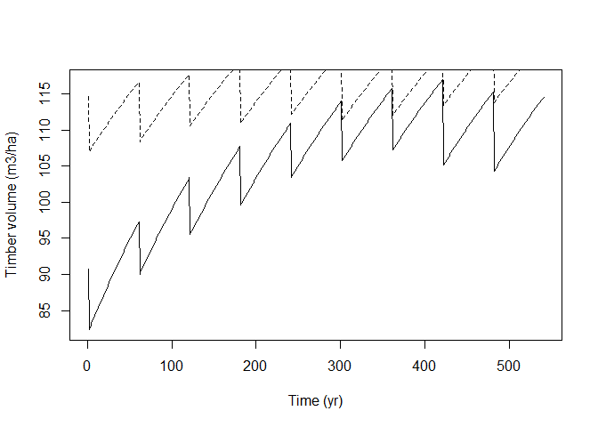
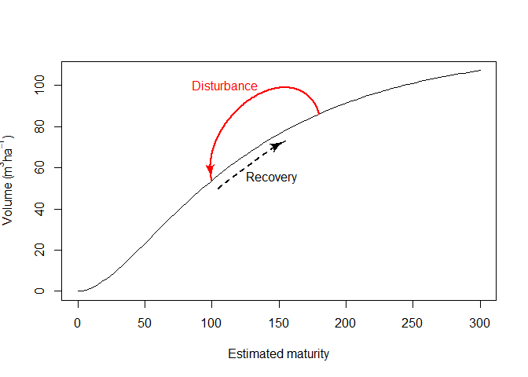
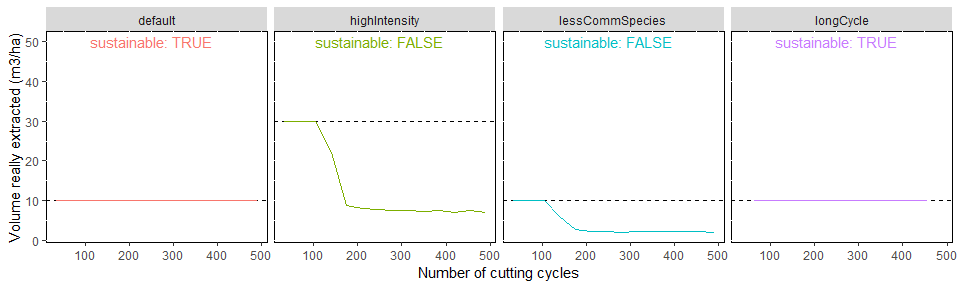
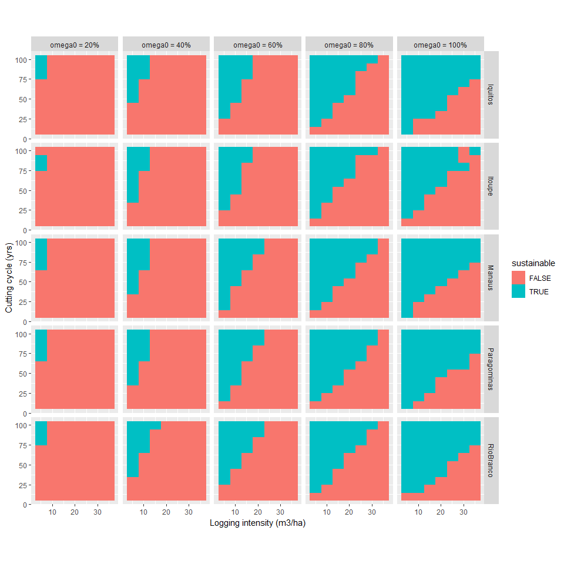
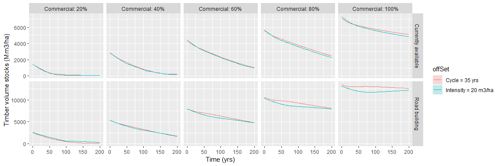

The aim of this study is to find concrete messages and/or recommendations to be integrated in a future policy brief. 

# Timber recovery model

## Quick recap

### Maturity and disturbance

The timber recovery model used in this study is decribed in a previous publication [@Piponiot2018]. In this model, the total volume of trees $\geq$ 50 cm DBH is modelled as a function of a new variable, the forest maturity, that is itself estimated using volume dynamics data (volume changes from growth and mortality). 

<!-- -->

The maturity increases (1 unit per year) when there is no disturbance and decreases abruptly when there is a disturbance, for example selective logging. 

<!-- -->

### Proportion of commercial volume

Only part of the total volume is commercial: the pre-logging proportion of commercial volume is $\omega_0$. Because logging targets commercial species, their proportion in the total volume $\omega$ decreases after logging (see the methodology paper for a complete decription of the model [@Piponiot2018]), but can increase again through recruitment of small trees (< 50 cm DBH). 

### Results at the Amazonian scale 

This model was calibrated with data from TmFO plots to make spatially-explicit predictions of post-logging timber recovery in Amazonia (paper submitted to Environmental Research Letters). 

## Exploring timber volume trajectories

We will first test 4 scenarios and look at the predicted trajectories in one location (here we use Manaus coordinates in central Amazonia).

Three input variables differ among scenarios: 

- the logging intensity (in m$^3$ha$^{-1}$)

- the length of the logging cycle (in years)

- $\omega 0$: the pre-logging proportion of commercial timber 

The following table summarizes the 4 scenarios and the values of each input variable. 

<table class="table" style="margin-left: auto; margin-right: auto;">
 <thead>
  <tr>
   <th style="text-align:left;"> scenario </th>
   <th style="text-align:left;"> intensity </th>
   <th style="text-align:left;"> cycle </th>
   <th style="text-align:left;"> omega0 </th>
  </tr>
 </thead>
<tbody>
  <tr>
   <td style="text-align:left;"> default </td>
   <td style="text-align:left;"> 10 m3/ha </td>
   <td style="text-align:left;"> 35 yr </td>
   <td style="text-align:left;"> 90% </td>
  </tr>
  <tr>
   <td style="text-align:left;"> highIntensity </td>
   <td style="text-align:left;"> 30 m3/ha </td>
   <td style="text-align:left;"> 35 yr </td>
   <td style="text-align:left;"> 90% </td>
  </tr>
  <tr>
   <td style="text-align:left;"> longCycle </td>
   <td style="text-align:left;"> 10 m3/ha </td>
   <td style="text-align:left;"> 65 yr </td>
   <td style="text-align:left;"> 90% </td>
  </tr>
  <tr>
   <td style="text-align:left;"> lessCommSpecies </td>
   <td style="text-align:left;"> 10 m3/ha </td>
   <td style="text-align:left;"> 35 yr </td>
   <td style="text-align:left;"> 30% </td>
  </tr>
</tbody>
</table>

The following figure shows the predicted trajectory of (commercial) timber volume stocks for each of the 4 scenarios. 

<!-- -->

The following figure shows the predicted timber production (m3/ha) at each cutting cycle (30 total) for each of the 4 scenarios. When there is not enough commercial timber left at the end of a cutting cycle to reach the desired logging intensity, the total production decreases (for example in the highIntensity and the lessCommonSpecies scenarios).

<!-- -->

# What criteria for sustainability? 

To explore the conditions upon which logging can be considered sustainable, we must first define sustainability. 

## Constant production

A possible criterion for sustainability is to have a constant production (i.e. no decrease in the volume really extracted) during a given period, e.g. the first 500 years. We illustrate this with the previously-described scenarios.

<!-- -->

> If you have some other ideas to define sustainability, this is open to any suggestion. 

## Effect of logging cycle and intensity

First we simulate timber recovery with $\omega_0 = 1$ (i.e. all species are commercial), and the conditions of central Amazonia (Manaus coordinates). Timber production is considered sustainble when the production is maintained to its desired level (i.e. the logging intensity) during the first 500 years. 

<!-- -->

> As expected, the chance of timber production being sustainable increases with longer cutting cycles and lower logging intensities. 

## Effect of location and proportion of commercial timber ($\omega_0$)

To explore how the location and the proportion of commercial timber can influence the sustainability of timber production, we simulated timber dynamics during the first 500 years for 5 locations (Iquitos in Peru, Itoupe in French Guiana, Manaus in Amazonas, Brazil, Paragominas in Para, Brazil and Rio Branco in Acre, Brazil). 

For each of these 5 locations we tested 5 proportions of commercial timber (from 20% to 100%), with varying logging intensities and cutting cycles. Results are presented in the following picture. 

<!-- -->

> The proportion of commerical timber is a strong predictor of timber production sustainability. Sustainability also depends to some degree on the location. 

## Effect of time period considered

Back to $\omega_0=1$ and the Manaus location, now we explore how the period of simulations (until now: 500 years) affects the assessmnet of sustainability. 

<!-- -->

> It seems that after 500 years, increasing the period of time does not change much the results: this is good news, we can stick with a 500-yr period!

# How much longer can we harvest at current rates?

Another question is the time that we can maintain current timber production at the Amazonian scale (appr. 35 Mm$3$ per year) before the there is not enough timber to meet this demand. 

Here we make the hypothesis that all potential production forests are logged. This can be either all forests that are not protected ("All unprotected") or unprotected forests that are $<$ 25 km from a motorable road or track ("Currently available"). 

We first set the cutting cycle length to a value $trot$ (eg 35 years). We want the logging intensity to be proportional to the amount of timber available in one pixel $p$: 

$$int_p = K \cdot vol_p$$ 

where $int_p$ is the logging intensity (in m$^3$ha$^{-1}$), K a constant (no dimension) and $vol_p$ the pre-logging timber volume in a pixel $p$ (in m$^3$ha$^{-1}$). 

The annual timber production is: 

$$Prod = \frac{\sum (int_p \cdot area_p)}{trot}$$
where $area_p$ is the area of potential production forests in one pixel $p$. 

We thus have: 

$$K = \frac{Prod \cdot trot}{\sum (vol_p \cdot area_p)} $$

Because the proportion of commercial timber affects the timber recovery, we tested 5 different values from 20% to 100% of commercial timber. 

The results are presented in 2 graphs: the total timber stocks (over all logged areas in Amazonia) and the total timber production. The first row corresponds to simulations with all currently available permanent production forests (not protected and < 25 km from a road or motorable track); the second row corresponds to simulations with 

<!-- -->

<!-- -->

> When the proportion of commercial timber is low, the timber production decreases rapidly and the demand cannont be met after the first logging cycle. In this case, alternative timber sources may be needed quickly. 

> Increasing the proportion of timber (by harvesting more species) can increase the probability of ensuring sustainable production.

# References
