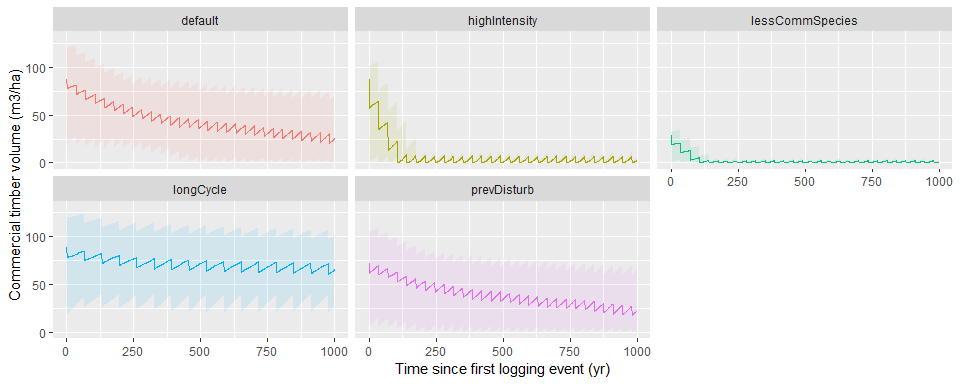
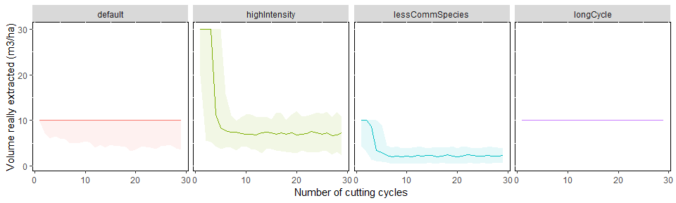
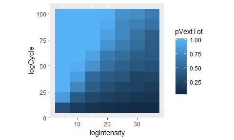
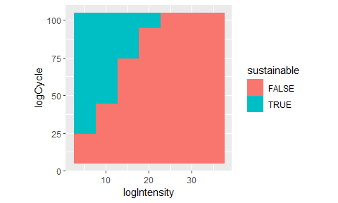
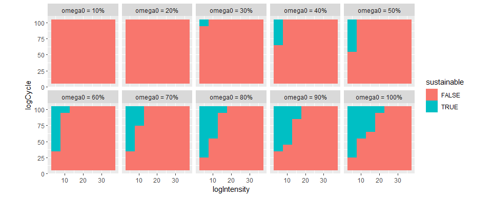
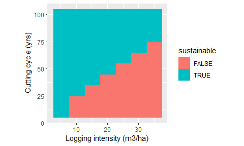
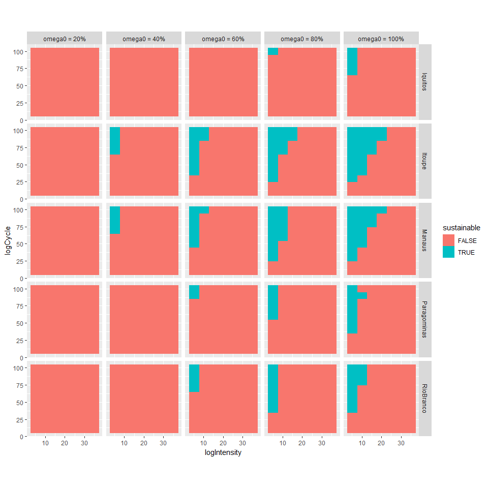
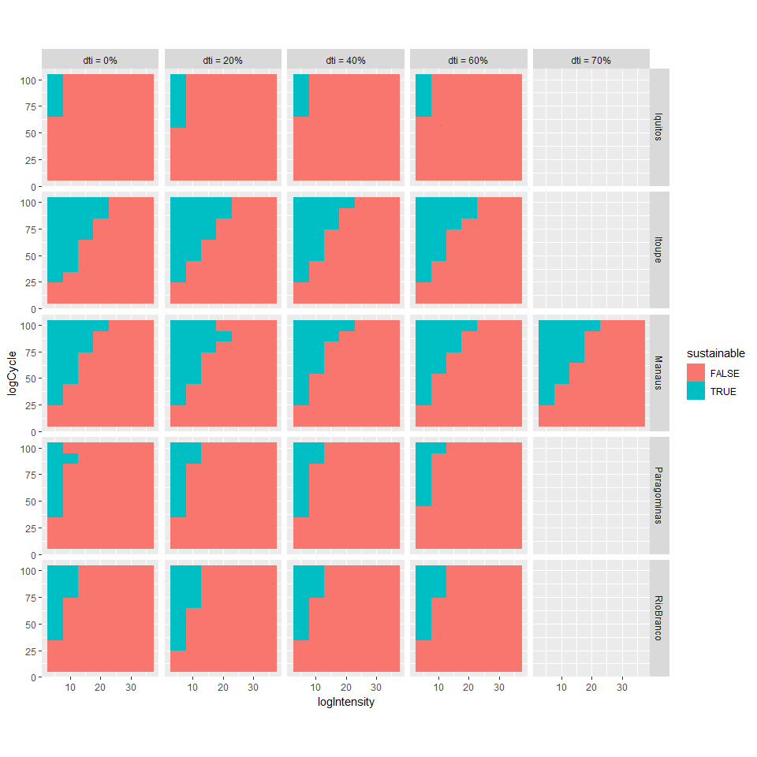

# Exploring timber volume trajectories

We will first test 5 scenarios and look at the predicted trajectories. The location stays the same (here we use Manaus coordinates in central Amazonia).

Four input variables differ among scenarios: 

- the logging intensity (in m$^3$ha$^{-1}$)

- the length of the logging cycle (in years)

- $\omega 0$: the pre-logging proportion of commercial timber 

- $dti$: the pre-logging disturbance factor (between 0 and 1): when $dti=0$, the site has suffered no human disturbance previous to logging; if $dti=1$, the site has been completely disturbed and clearcut. 

## Timber recovery trajetories depending on input variables

The following table summarizes the 5 scenarios and the values of each input variable. 

<table class="table" style="margin-left: auto; margin-right: auto;">
 <thead>
  <tr>
   <th style="text-align:left;"> scenario </th>
   <th style="text-align:right;"> logIntensity </th>
   <th style="text-align:right;"> logCycle </th>
   <th style="text-align:right;"> omega0 </th>
   <th style="text-align:right;"> dti </th>
  </tr>
 </thead>
<tbody>
  <tr>
   <td style="text-align:left;"> default </td>
   <td style="text-align:right;"> 10 </td>
   <td style="text-align:right;"> 35 </td>
   <td style="text-align:right;"> 0.9 </td>
   <td style="text-align:right;"> 0.1 </td>
  </tr>
  <tr>
   <td style="text-align:left;"> highIntensity </td>
   <td style="text-align:right;"> 30 </td>
   <td style="text-align:right;"> 35 </td>
   <td style="text-align:right;"> 0.9 </td>
   <td style="text-align:right;"> 0.1 </td>
  </tr>
  <tr>
   <td style="text-align:left;"> longCycle </td>
   <td style="text-align:right;"> 10 </td>
   <td style="text-align:right;"> 65 </td>
   <td style="text-align:right;"> 0.9 </td>
   <td style="text-align:right;"> 0.1 </td>
  </tr>
  <tr>
   <td style="text-align:left;"> lessCommSpecies </td>
   <td style="text-align:right;"> 10 </td>
   <td style="text-align:right;"> 35 </td>
   <td style="text-align:right;"> 0.3 </td>
   <td style="text-align:right;"> 0.1 </td>
  </tr>
  <tr>
   <td style="text-align:left;"> prevDisturb </td>
   <td style="text-align:right;"> 10 </td>
   <td style="text-align:right;"> 35 </td>
   <td style="text-align:right;"> 0.9 </td>
   <td style="text-align:right;"> 0.4 </td>
  </tr>
</tbody>
</table>

The following figure shows the predicted trajectory of timber volume stocks for each of the 5 scenarios. 

<!-- -->

The following figure shows the predicted trajectory of timber volume stocks for each of the 5 scenarios. 

<!-- -->

Only the "longCycle" scenario maintains high levels of timber volume and a constant production after 1000 years; it can be considered sustainable. 

## Configurations of logging that are sustainable

For now we consider logging sustainable if the production (max-likelihood) stays constant during the first 100 cycles. 

### In perfect conditions 

The following picture shows the proportion of extracted volume compared to the expected logging intensity over the first 100 cycles. If this proportion is 1, then logging can be considered sustainable. 

First we use a "perfect conditions" scenario with $\omega_0 = 1$ (all species are commercial) and that $dti = 0$ (no pre-logging anthropogenic disturbance). 

<!-- --><!-- -->

### Effect of diversifying commercial species (ie changing $\omega_0$)

<!-- -->

### Effect of adding prelogging anthropogenic disturbances (ie changing $dti$)

<!-- -->

## Changing the location

For now we consider logging sustainable if the production (max-likelihood) stays constant during the first 100 cycles. 

### Effect of diversifying commercial species (ie changing $\omega_0$)

<!-- -->

### Effect of adding prelogging anthropogenic disturbances (ie changing $dti$)

<!-- -->
